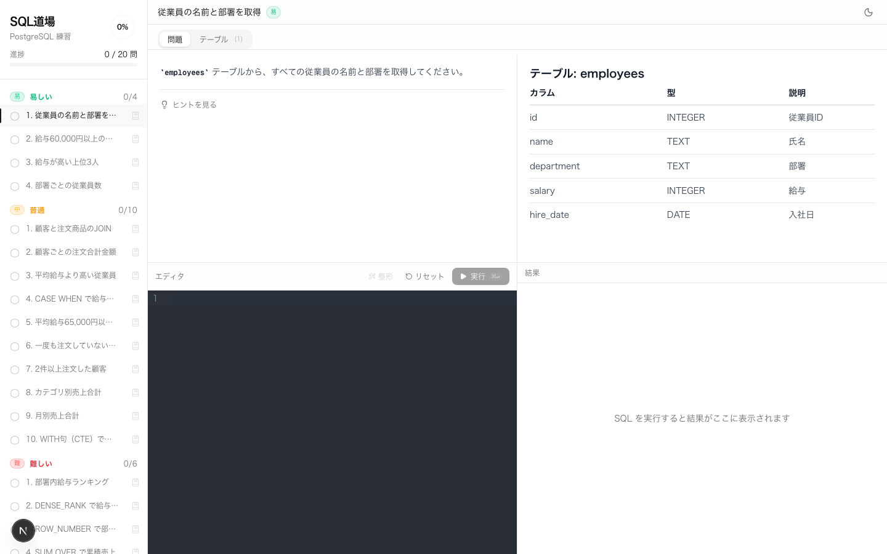
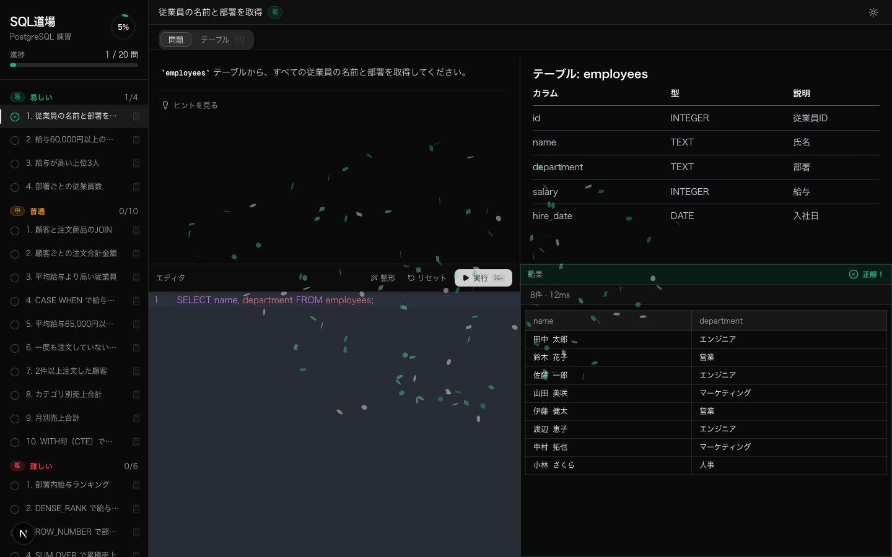

# SQL道場

ブラウザ上で PostgreSQL を学べる対話型の SQL 練習アプリです。サーバー不要・インストール不要でリアルタイムにクエリを実行し、自動正誤判定を受けながら学習できます。


## 特徴

- **ブラウザ内 PostgreSQL 実行** — [PGlite](https://github.com/electric-sql/pglite) (WASM) により、サーバーなしで本物の PostgreSQL 構文を実行
- **自動正誤判定** — 期待クエリと結果を比較し、カラム順・NULL・浮動小数点誤差を考慮して判定
- **全20問** — 易・中・難の3段階、SELECT から ウィンドウ関数・CTE まで段階的に学習
- **リッチなエディタ** — シンタックスハイライト・キーワード補完・エラー下線表示
- **左右2ペイン表示** — 問題文とテーブル定義を並べて確認しながら解答
- **復習マーク** — 後で見直したい問題にブックマークを付けられる
- **進捗管理** — 難易度別グループ表示・解答状況をローカルに保存
- **ダークモード** — システム設定に合わせたテーマ切り替え

## スクリーンショット

### メイン画面（ライトモード）



### SQL実行・正解判定（ダークモード）



## 問題一覧

| 難易度 | 問題数 | 扱うトピック |
|--------|--------|-------------|
| 易     | 4問    | SELECT、WHERE、ORDER BY / LIMIT、GROUP BY |
| 中     | 10問   | JOIN、集計関数、サブクエリ、CASE WHEN、HAVING、CTE |
| 難     | 6問    | ウィンドウ関数（RANK / DENSE_RANK / ROW_NUMBER / LAG / SUM OVER）、複合CTE |

## 技術スタック

| カテゴリ | 技術 |
|----------|------|
| フレームワーク | Next.js 15 (App Router) |
| 言語 | TypeScript 5 |
| スタイリング | Tailwind CSS + shadcn/ui |
| SQL エンジン | PGlite (PostgreSQL WASM) |
| エディタ | CodeMirror 6 (`@codemirror/lang-sql`) |
| マークダウン | react-markdown + remark-gfm |
| 状態管理 | React useState / useEffect |
| 永続化 | localStorage |

## ローカルでの実行

```bash
# リポジトリのクローン
git clone https://github.com/yukikogai/sql-dojyo-app.git
cd sql-dojyo-app

# 依存関係のインストール
npm install

# 開発サーバーの起動
npm run dev
```

ブラウザで [http://localhost:3000](http://localhost:3000) を開いてください。

## ディレクトリ構成

```
sql-dojyo-app/
├── app/
│   ├── page.tsx          # メインページ（状態管理・判定ロジック）
│   ├── layout.tsx        # ルートレイアウト（FOUC防止スクリプト）
│   └── globals.css       # グローバルスタイル
├── components/
│   ├── problem-sidebar.tsx  # サイドバー（進捗・難易度グループ・復習マーク）
│   ├── sql-editor.tsx       # CodeMirrorエディタ
│   ├── result-table.tsx     # クエリ結果テーブル
│   ├── table-viewer.tsx     # テーブルデータビューア
│   ├── theme-provider.tsx   # ダークモード管理
│   └── ui/                  # shadcn/ui コンポーネント
├── lib/
│   ├── problems.ts          # 全20問の定義・スキーマ・解答
│   ├── progress.ts          # 進捗・復習マークのlocalStorage操作
│   └── schema-parser.ts     # CREATEからオートコンプリート情報を抽出
└── types/
    └── index.ts             # 型定義
```

## ライセンス

MIT
